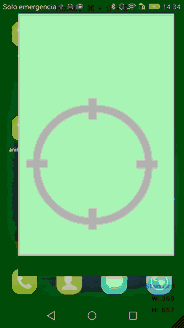

Remote Display Sample for Android
=================

*Google Cast's Remote Display Sample for Android*

This sample shows how to use the new Google Cast feature called Remote Display. Your sender app can now render directly to any Cast receiver, like a Chromecast. 
The remote display on the receiver can present information that is entirely different than the information presented in the display on the sender device.

 

<b><a href="#about">About</a></b>
|
<b><a href="#who-made-this">Who made this</a></b>

 

About
-----

This project is part of an article from the Schibsted Spain tech blog.

Schibsted Media Group is an international media group with 6800 employees in 30 countries. Our strategy to become a global leader within our fields is bold. It consists of three elements that work seamlessly together: Classifieds, Growth and Media houses.

We aim to be a global leader in online marketplaces and offer the best solutions and services for our users.We invest in great entrepreneurs and help scale their businesses locally and internationally by leveraging the Schibsted ecosystem.We are building world class digital Media houses that will shape the media landscape for years to come.

Who made this
--------------

Hi! I'm <a href="https://www.ferranpons.com">Ferran Pons</a>; a Senior Android Developer that works for Schibsted Spain developing the Vibbo application. 
With almost 12 years of experience as a programmer, my experience covers a lot of different kind of applications, from web app development to the desktop, mobile apps and videogames. I've participated in some blockbuster games such as Burnout Paradise, DeadSpace and the Skate franchise. Also I've tried to start up my own indie videogame studio, labeled "Retrowax Games" with which I've made a game called Zombusters that it's published for the Xbox360 and Windows Phone and PC.
 

